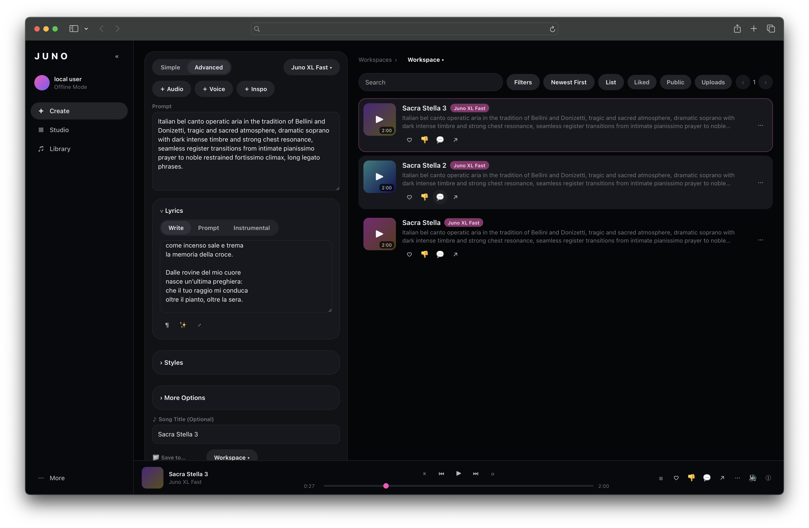

# Juno


An offline, self-hosted AI music workstation with a Suno-style workflow,
powered locally by **ACE-Step 1.5 XL** models. One Docker image runs the
ACE-Step API server and the Juno web app; everything — model weights,
generated audio, uploads, and your library — stays on your machine.

<p align="center">
  
</p>


## What Juno Includes

- **Create** — prompt + lyrics (Write / Prompt / Instrumental) + style chips
  + More Options (Vocal Gender, Weirdness, Style Influence, Exclude), saved
  into workspaces, with live task status per song row.
- **Library** — 11 tabs: Songs, Playlists, Workspaces, Studio Projects,
  Voices, Lyrics, Styles, Cover Art, Hooks, Liked Hooks, History; plus
  uploads (MP3/WAV/M4A/OGG/FLAC) and Trash with restore / delete forever.
- **Studio** — multi-track arrangement view with region-based Generate /
  Repaint / Extend actions on the ACE-Step base model.
- **Editor** — per-song waveform editing: Crop, Remove Section, Replace
  Section (ACE-Step repaint), Adjust Speed, Reverse, Export.
- **Persistent player** — full transport, queue, like/dislike, volume,
  track info.
- **Local proxy API** on port 3000 that translates Juno requests into
  ACE-Step API calls (port 8001) and manages the on-disk library.
- No accounts, credits, plans, ads, or telemetry. The profile is always
  "local user / Offline Mode".

## Hardware Assumptions

- NVIDIA GPU with **32 GB VRAM** (the three exposed presets are all
  XL-class with the 4B language model; smaller ACE-Step variants exist but
  are intentionally not exposed in the UI).
- ~60 GB free disk for model weights (downloaded on first run) plus space
  for outputs.
- Docker with the NVIDIA Container Toolkit installed.
- Linux host recommended. CUDA 12.4 base image.

## Model Stack

Weights are **not** included in this ZIP and are **not** baked into the
Docker image. On first start they are downloaded from Hugging Face into the
host-mounted `./models` directory:

| Purpose | Hugging Face repo | Local path |
|---|---|---|
| Juno XL Quality (default, SFT) | `ACE-Step/acestep-v15-xl-sft` | `/models/acestep-v15-xl-sft` |
| Juno XL Fast (Turbo, 8 steps, no CFG) | `ACE-Step/acestep-v15-xl-turbo` | `/models/acestep-v15-xl-turbo` |
| Juno XL Studio (base) | `ACE-Step/acestep-v15-xl-base` | `/models/acestep-v15-xl-base` |
| Language model (all presets) | `ACE-Step/acestep-5Hz-lm-4B` | `/models/acestep-5Hz-lm-4B` |

## Quick Start

```bash
cd juno
cp .env.example .env      # edit paths / HF_TOKEN if needed
docker compose up --build
```

Then open **http://localhost:3000**.

If your Docker installation doesn't support `docker compose` GPU
reservations, the equivalent manual run is:

```bash
docker build -t juno:latest .
docker run --gpus all \
  -p 3000:3000 -p 8001:8001 \
  -v "$(pwd)/models:/models" \
  -v "$(pwd)/outputs:/outputs" \
  -v "$(pwd)/uploads:/uploads" \
  -v "$(pwd)/data:/data" \
  -v "$(pwd)/hf-cache:/root/.cache/huggingface" \
  -e HF_TOKEN="${HF_TOKEN:-}" \
  juno:latest
```

## First Run Behavior

1. `scripts/entrypoint.sh` creates the storage directories
   (`/outputs/library`, `/outputs/tmp`, `/outputs/cache/*`, `/uploads`,
   `/data`).
2. `scripts/download_models.py` downloads any missing model repos into
   `/models` (resumable; already-populated directories are skipped).
   **The first download is tens of gigabytes — expect it to take a while.**
3. `scripts/verify_models.py` confirms all four model directories exist and
   are non-empty, then symlinks them into
   `/app/ACE-Step-1.5/checkpoints/`.
4. `supervisord` starts the ACE-Step API (port 8001) and the Juno
   web/proxy server (port 3000).
5. The UI is usable immediately with mock data; real generation becomes
   available once ACE-Step reports healthy and the model is initialized
   (the Create panel's Model Status card shows this and offers an
   "Initialize model" button).

## Environment Variables

Set in `.env` (see `.env.example`) or the shell:

| Variable | Default | Meaning |
|---|---|---|
| `JUNO_MODEL_DIR` | `./models` | Host directory mounted at `/models` |
| `JUNO_OUTPUT_DIR` | `./outputs` | Host directory mounted at `/outputs` |
| `JUNO_UPLOAD_DIR` | `./uploads` | Host directory mounted at `/uploads` |
| `JUNO_DATA_DIR` | `./data` | Host directory mounted at `/data` (library DB) |
| `HF_HOME` | `./hf-cache` | Hugging Face cache mount |
| `HF_TOKEN` | (empty) | Hugging Face token, if the repos require auth or you hit rate limits |

Container-side variables (already set in `docker-compose.yml`):
`ACESTEP_API_HOST/PORT`, `ACESTEP_CONFIG_PATH`(/`2`/`3`) pointing at the
three DiT models, `ACESTEP_INIT_LLM=true`, `ACESTEP_LM_MODEL_PATH`,
`ACESTEP_LM_BACKEND=vllm`, `ACESTEP_DEVICE=auto`,
`ACESTEP_USE_FLASH_ATTENTION=true`, `ACESTEP_OFFLOAD_TO_CPU=false`,
`ACESTEP_OFFLOAD_DIT_TO_CPU=false`, `ACESTEP_TMPDIR=/outputs/tmp`,
`TRITON_CACHE_DIR`, `TORCHINDUCTOR_CACHE_DIR`, and the `JUNO_*` mirrors.

## Manual Model Download

If you prefer to pre-download (or the automatic download fails):

```bash
pip install "huggingface_hub>=0.23"
export HF_TOKEN=...   # only if required

for repo in acestep-v15-xl-sft acestep-v15-xl-turbo acestep-v15-xl-base acestep-5Hz-lm-4B; do
  hf download "ACE-Step/${repo}" --local-dir "./models/${repo}"
done
```

(Older CLI versions: `huggingface-cli download ...` with the same
arguments.) The container will detect the populated directories and skip
downloading.

## Model Verification

```bash
docker compose exec juno python3 /app/juno/scripts/verify_models.py
```

Prints one line per model directory. All four must be present and
non-empty:
`/models/acestep-v15-xl-sft`, `/models/acestep-v15-xl-turbo`,
`/models/acestep-v15-xl-base`, `/models/acestep-5Hz-lm-4B`.

## Health Checks

```bash
# Juno proxy + aggregated ACE-Step status
curl http://localhost:3000/api/health

# Model preset status (available on disk / loaded in memory)
curl http://localhost:3000/api/models

# ACE-Step API directly
curl http://localhost:8001/health
```

`/api/health` reports `{"juno":"ok","aceStep":"ok", ...}` when everything
is up. `aceStep":"unavailable"` while models are still downloading or the
server is starting is expected.

## Docker GPU Troubleshooting

Verify the NVIDIA runtime works at all:

```bash
docker run --rm --gpus all nvidia/cuda:12.4.1-base-ubuntu22.04 nvidia-smi
```

- If that fails: install/repair the **NVIDIA Container Toolkit**
  (`nvidia-ctk runtime configure --runtime=docker && sudo systemctl
  restart docker`).
- `could not select device driver "nvidia"` → toolkit not registered with
  Docker.
- Driver/CUDA mismatch → host driver must support CUDA 12.4 (driver
  ≥ 550.x).
- Inside the container: `docker compose exec juno nvidia-smi`.

## HF Download Troubleshooting

- **401/403** — set `HF_TOKEN` in `.env` (create one at
  huggingface.co/settings/tokens) and accept the model licenses on the
  repo pages if prompted.
- **429 rate limit** — wait and re-run; downloads resume where they left
  off.
- **Disk full** — the four repos total tens of GB; check
  `df -h ./models`.
- **Corporate proxy/TLS issues** — pre-download on another machine (see
  Manual Model Download) and copy the `models/` folder over.
- Partial downloads are safe: `snapshot_download` resumes, and non-empty
  completed directories are skipped.

## Port Conflicts

Ports **3000** (web) and **8001** (ACE-Step) must be free. Change the host
side of the mappings in `docker-compose.yml` (e.g. `"3300:3000"`) if
something else owns them; the in-container ports stay as-is.

## Output Locations

| Content | Host path |
|---|---|
| Generated songs (library copies) | `./outputs/library/` |
| Export manifests | `./outputs/exports/` |
| Uploaded audio | `./uploads/` |
| Library database | `./data/juno-db.json` |
| Model weights | `./models/` |
| HF cache | `./hf-cache/` |
| Temp / compile caches | `./outputs/tmp`, `./outputs/cache/` |

## Legal Note

Juno is an independent, offline project for personal/local use. It is not
affiliated with Suno. ACE-Step models are downloaded directly from their
Hugging Face repositories under their respective licenses — review those
licenses (including any restrictions on generated-output usage) before
distributing anything you create. You are responsible for the content you
generate with your own hardware.

## Running Without Models (UI-only mode)

To explore the full UI without downloading ~60 GB of weights (or on a
machine without a suitable GPU):

```bash
JUNO_SKIP_MODELS=true docker compose up --build
```

Everything renders and works from mock data — pages, player, library
tabs, editor, studio, all song-row states. ACE-Step shows as
"unavailable", the ACE-Step process may restart-loop harmlessly in the
logs, and any generation attempt creates a documented failed row instead
of audio. Later, run normally (without the flag) and the models download;
nothing else changes. Local-only actions (Crop, Reverse, Speed, uploads,
exports, playlists) work fully in this mode.
